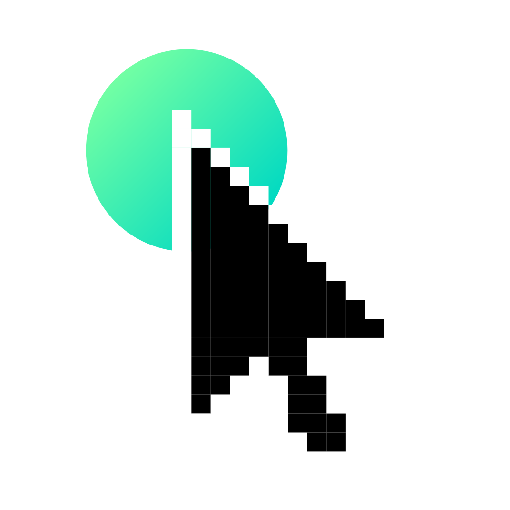

> [!NOTE]
> **This is an older version of Usabilitree.** A complete overhaul and redesign is currently in progress. Stay tuned for major updates!

<div align="center">
  
  
  # Usabilitree
  
  **Optimize UX with Tree Testing**
  
  Create, conduct, and analyze tree tests for free. Optimize your information architecture with valuable insights.
  
  🌐 **Live Site**: [usabilitree.com](https://usabilitree.com)
</div>

## 📋 About

Usabilitree is a comprehensive tree testing platform that helps UX researchers and designers optimize their information architecture. Tree testing is a usability technique used to evaluate the findability of topics in a website's navigation structure.

### ✨ Features

- **Free Tree Testing**: Create and conduct tree tests at no cost
- **Easy Test Creation**: Intuitive interface for setting up tree structures
- **Real-time Analytics**: Analyze participant behavior and navigation patterns
- **User-friendly Dashboard**: Manage all your tests from a centralized location

## 🚀 Getting Started

### Prerequisites

- Node.js 18+ and npm/yarn/pnpm
- A database (SQLite/Turso for development)

### Installation

1. Clone the repository:

```bash
git clone https://github.com/ubergonmx/usabilitree-next.git
cd usabilitree-next
```

2. Install dependencies:

```bash
npm install
```

3. Set up environment variables:

```bash
cp .env.example .env.local
# Edit .env.local with your configuration
```

4. Set up the database:

```bash
npm run db:generate
npm run db:migrate
```

5. Run the development server:

```bash
npm run dev
```

Open [http://localhost:3000](http://localhost:3000) to view the application.

## 🛠️ Tech Stack

- **Framework**: [Next.js 14](https://nextjs.org) with App Router
- **Language**: TypeScript
- **Styling**: Tailwind CSS + shadcn/ui components
- **Database**: Drizzle ORM with SQLite/Turso
- **Authentication**: Custom auth with Arctic
- **Animations**: Framer Motion
- **Analytics**: PostHog + Vercel Analytics
- **Error Tracking**: Sentry
- **Email**: React Email

## 📁 Project Structure

```
src/
├── app/                    # Next.js app router pages
│   ├── (auth)/            # Authentication pages
│   ├── (landing)/         # Marketing pages
│   ├── (main)/            # Main application
│   └── (tools)/           # Tree testing tools
├── components/            # Reusable components
│   └── ui/               # shadcn/ui components
├── db/                    # Database schema and configuration
├── lib/                   # Utilities and configurations
│   ├── auth/             # Authentication logic
│   ├── treetest/         # Tree testing functionality
│   └── validators/       # Zod schemas
└── styles/               # Global styles
```

## 🗃️ Database Commands

```bash
# Generate migrations
npm run db:generate

# Apply migrations
npm run db:migrate

# Push schema changes
npm run db:push

# Open Drizzle Studio
npm run db:studio
```

## 🔧 Development

```bash
# Format code
npm run format

# Type checking
npm run types

# Lint
npm run lint

# Build for production
npm run build

# Start production server
npm run start
```

## 🚀 Deployment

The application is designed to be deployed on [Vercel](https://vercel.com) with automatic deployments from the main branch.

### Environment Variables

Copy `.env.example` to `.env.local` and configure the following variables:

#### Core Application

- `NEXT_PUBLIC_APP_URL` - Your application URL (e.g., `http://localhost:3000` for development)
- `NODE_ENV` - Environment mode (`development`, `production`)
- `SECRET_HASH` - Secret hash for encryption (generate a secure random string)

#### Database

- `DATABASE_URL` - Database connection string (e.g., `file:local.db` for SQLite)
- `DATABASE_AUTH_TOKEN` - Database authentication token (required for Turso)

#### Authentication

- `DISCORD_CLIENT_ID` - Discord OAuth client ID
- `DISCORD_CLIENT_SECRET` - Discord OAuth client secret
- `DISCORD_BOT_TOKEN` - Discord bot token (for notifications)
- `GOOGLE_CLIENT_ID` - Google OAuth client ID
- `GOOGLE_CLIENT_SECRET` - Google OAuth client secret

#### Email Configuration

- `MOCK_SEND_EMAIL` - Set to `true` for development to mock email sending
- `EMAIL_SENDER` - Email address for sending emails

**Option 1: SendGrid**

- `SENDGRID_API_KEY` - SendGrid API key

**Option 2: SMTP (Nodemailer)**

- `SMTP_HOST` - SMTP server host
- `SMTP_PORT` - SMTP server port
- `SMTP_USER` - SMTP username
- `SMTP_PASSWORD` - SMTP password

#### Analytics & Monitoring

- `NEXT_PUBLIC_POSTHOG_KEY` - PostHog analytics key
- `NEXT_PUBLIC_POSTHOG_HOST` - PostHog host URL
- `SENTRY_AUTH_TOKEN` - Sentry authentication token for error tracking

#### Application Limits

- `STUDY_LIMIT` - Maximum number of studies per user (default: 7)

## 🤝 Contributing

Contributions are welcome! Please feel free to submit a Pull Request.

## 📄 License

This project is licensed under the [GNU Affero General Public License v3.0](LICENSE) - see the LICENSE file for details or https://www.gnu.org/licenses/agpl-3.0.txt.

## 👨‍💻 Author

Built by [aaronpal](https://github.com/ubergonmx)

## 📞 Support

- **Discord**: [Contact on Discord](https://discord.com/users/263841596213035009)
- **Issues**: [GitHub Issues](https://github.com/ubergonmx/usabilitree-next/issues)

---

_Optimize your information architecture with Usabilitree - Free tree testing for better UX._
